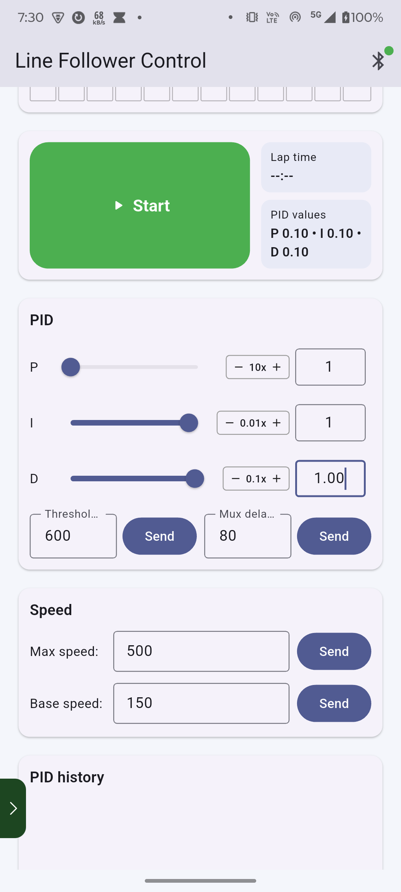

# Line Follower Pro Max 🤖

A full-featured mobile app and ESP32 firmware for controlling and tuning an autonomous line-following robot. The system uses a 12-channel sensor array, a PID control algorithm, and Bluetooth communication to give you real-time visibility and control from your Android device.



---

## Table of Contents

- [Features](#features)
- [Hardware Requirements](#hardware-requirements)
- [Wiring Reference](#wiring-reference)
- [Software Requirements](#software-requirements)
- [Getting Started](#getting-started)
  - [1. Flash the Firmware](#1-flash-the-firmware)
  - [2. Build & Run the Flutter App](#2-build--run-the-flutter-app)
- [App Usage](#app-usage)
  - [Connecting via Bluetooth](#connecting-via-bluetooth)
  - [Calibrating Sensors](#calibrating-sensors)
  - [Tuning PID Values](#tuning-pid-values)
  - [Controlling Speed](#controlling-speed)
  - [Viewing Run History](#viewing-run-history)
- [Bluetooth Command Reference](#bluetooth-command-reference)
  - [Commands Sent from App to Robot](#commands-sent-from-app-to-robot)
  - [Messages Sent from Robot to App](#messages-sent-from-robot-to-app)
- [Project Structure](#project-structure)
- [Dependencies](#dependencies)
- [Contributing](#contributing)
- [License](#license)

---

## Features

### Mobile App
- **Live sensor visualization** — 12 sensors displayed as on/off indicators or raw ADC values (0–4095)
- **Real-time PID tuning** — Adjust Kp, Ki, Kd with fine-grained +/- controls or direct text entry
- **Speed control** — Set maximum and base motor speeds independently
- **Per-sensor threshold calibration** — Individual sliders or a single bulk-threshold setter
- **Run history** — Save successful runs and restore any previous PID configuration in one tap
- **Runtime tracking** — Displays elapsed time in mm:ss.ms format
- **Auto-stop** — Automatically stops the robot when the finish line is detected
- **Line-lost recovery** — Robot spins to re-acquire the line if it is lost
- **Persistent settings** — Default values survive app restarts via SharedPreferences

### Firmware (ESP32)
- **12-channel analog multiplexer** for sensor array reading
- **Differential-drive PID controller** for smooth line following
- **Black/White calibration** via onboard buttons
- **Finish-line detection** — recognises a fully black reading held for 100 ms
- **Bluetooth Serial streaming** — sensor values, thresholds, and acknowledgements every 100 ms
- **Legacy command support** — old single-character commands still accepted

---

## Hardware Requirements

| Component | Details |
|-----------|---------|
| Microcontroller | ESP32 (any dev board) |
| Sensor array | 12-channel IR/analog line sensor |
| Multiplexer | 4-to-16 (e.g., CD74HC4067) |
| Motor driver | TB6612FNG (or compatible) |
| Motors | 2 × DC gear motors |
| Bluetooth | Built-in ESP32 Bluetooth or HC-05 module |
| Power supply | 7–12 V battery pack |
| Misc | Push buttons (×3), LED (×1) |

---

## Wiring Reference

### Motors & Motor Driver

| Signal | ESP32 GPIO |
|--------|-----------|
| AIN1   | 13 |
| AIN2   | 14 |
| PWMA   | 26 |
| BIN1   | 12 |
| BIN2   | 27 |
| PWMB   | 25 |
| STBY   | 33 |

### Sensor Multiplexer

| Signal | ESP32 GPIO |
|--------|-----------|
| MUX_SIG (analog in) | 34 |
| S0 | 16 |
| S1 | 5  |
| S2 | 18 |
| S3 | 19 |

### Buttons & LED

| Component | ESP32 GPIO |
|-----------|-----------|
| START button | 21 |
| BLACK calibration button | 4  |
| WHITE calibration button | 15 |
| Status LED | 2  |

---

## Software Requirements

- [Flutter SDK](https://flutter.dev/docs/get-started/install) ≥ 3.10.1 (Dart ≥ 3.10.1)
- [Arduino IDE](https://www.arduino.cc/en/software) with **ESP32 board support**
- Android device with Bluetooth (Android 6.0+)
- A paired Bluetooth device on the robot (built-in ESP32 BT or HC-05)

---

## Getting Started

### 1. Flash the Firmware

1. Open `hardware_updated.ino` in Arduino IDE.
2. Select your ESP32 board (**Tools → Board → ESP32 Dev Module**).
3. Verify the pin definitions at the top of the file match your wiring.
4. Click **Upload**.
5. Open the Serial Monitor (115200 baud) to confirm the robot boots and streams sensor data.

### 2. Build & Run the Flutter App

```bash
# Clone the repository
git clone https://github.com/Amalshaheen/line_follower_pro_max.git
cd line_follower_pro_max

# Install dependencies
flutter pub get

# Run on a connected Android device
flutter run
```

> **Note:** The app requires Bluetooth and Location permissions on Android. Accept the permission prompts on first launch.

---

## App Usage

### Connecting via Bluetooth

1. Pair your phone with the robot's Bluetooth module in the Android system settings.
2. In the app, tap the **Bluetooth icon** in the top-right corner to open Bluetooth Settings.
3. Select the robot from the dropdown list of bonded devices.
4. Tap **Connect**. The status indicator turns green when connected.

### Calibrating Sensors

Calibration maps each sensor's raw ADC range to a binary on/off threshold.

**Using onboard buttons:**
1. Place the robot over a **black** surface → press the BLACK button.
2. Place the robot over a **white** surface → press the WHITE button.
3. Thresholds are calculated automatically and stored on the ESP32.

**Using the app:**
1. Open the **Sensors** card on the dashboard.
2. Enable **Calibration Mode** with the toggle.
3. Adjust individual sensor sliders, or enter a value in **All Sensor Threshold** and tap send.
4. Tap **Save Calibration** to push all thresholds to the robot.

### Tuning PID Values

PID controls how aggressively the robot corrects its steering.

| Parameter | Effect | Typical start |
|-----------|--------|---------------|
| **Kp** (Proportional) | Immediate correction strength | 30.0 |
| **Ki** (Integral) | Corrects long-term drift | 0.0 |
| **Kd** (Derivative) | Dampens oscillation | 0.0 |

1. Use the **+/−** buttons on the PID card to adjust values (tap for 0.1 steps, hold for continuous).
2. Or type a value directly into the text field.
3. Tap **Send All** to transmit the new values to the robot.

### Controlling Speed

| Setting | Description | Range |
|---------|-------------|-------|
| **Max Speed** | Motor speed cap | 0–255 |
| **Base Speed** | Default straight-line speed | 0–255 |

Tap the send arrow next to each field to apply changes immediately.

### Viewing Run History

- Successful runs (where the finish line was detected) are saved automatically.
- Open the **History** card to see runtime, PID values, and timestamp for each run.
- Tap **Restore** on any run to reload its PID and speed settings.
- Tap the trash icon to delete a single run, or **Clear All** to wipe history.

---

## Bluetooth Command Reference

### Commands Sent from App to Robot

| Command | Example | Description |
|---------|---------|-------------|
| `KP=<value>` | `KP=30.0` | Set proportional gain |
| `KI=<value>` | `KI=0.5` | Set integral gain |
| `KD=<value>` | `KD=1.2` | Set derivative gain |
| `BASE=<value>` | `BASE=150` | Set base motor speed (0–255) |
| `MAX=<value>` | `MAX=255` | Set maximum motor speed (0–255) |
| `RUN=1` / `RUN=0` | `RUN=1` | Start / stop the robot |
| `CAL=BLACK` | `CAL=BLACK` | Trigger black-surface calibration |
| `CAL=WHITE` | `CAL=WHITE` | Trigger white-surface calibration |
| `THR=<idx>,<val>` | `THR=3,2000` | Set threshold for sensor index |
| `THRALL=<val>` | `THRALL=2048` | Set all sensor thresholds at once |
| `AUTOSTOP=1/0` | `AUTOSTOP=1` | Enable/disable auto-stop on finish |
| `LINELOST=1/0` | `LINELOST=1` | Enable/disable line-lost recovery |
| `TIME?` | `TIME?` | Query last run time |
| `THRESH?` | `THRESH?` | Query current thresholds |

### Messages Sent from Robot to App

| Message | Example | Description |
|---------|---------|-------------|
| `SENSORS:<vals>` | `SENSORS:2100,1900,...` | 12 comma-separated ADC values (0–4095) |
| `THRESHOLDS:<vals>` | `THRESHOLDS:2048,2048,...` | 12 current threshold values |
| `ACK:<cmd>=<val>` | `ACK:KP=30.0` | Acknowledgement of a received command |
| `TRACK_FINISHED` | `TRACK_FINISHED` | Finish line detected |
| `Robot Started` | `Robot Started` | Robot began running |
| `Robot Stopped` | `Robot Stopped` | Robot stopped |

---

## Project Structure

```
line_follower_pro_max/
├── hardware_updated.ino        # ESP32 Arduino firmware
├── lib/
│   ├── main.dart               # App entry point
│   ├── constants/
│   │   └── app_constants.dart  # App-wide constants and default values
│   ├── models/
│   │   ├── pid_config.dart     # PID & speed configuration model
│   │   ├── robot_state.dart    # Robot state and Bluetooth state
│   │   └── pid_run_history.dart# Run history data model
│   ├── services/
│   │   ├── bluetooth_service.dart  # Bluetooth discovery, connection, parsing
│   │   ├── history_service.dart    # Run history persistence
│   │   └── settings_service.dart   # Settings persistence
│   ├── screens/
│   │   ├── dashboard_page.dart         # Main control interface
│   │   ├── bluetooth_settings_page.dart# Bluetooth device management
│   │   └── settings_page.dart          # Default settings
│   └── widgets/
│       ├── control_summary_card.dart   # Start/stop, runtime, toggles
│       ├── pid_card.dart               # PID value editors
│       ├── pid_digit_editor_row.dart   # +/- and text entry for PID digits
│       ├── speed_card.dart             # Speed controls
│       ├── speed_field_row.dart        # Individual speed input row
│       ├── sensors_card.dart           # Sensor grid with calibration
│       ├── sensor_bar.dart             # Single sensor indicator
│       ├── history_card.dart           # Run history list
│       ├── info_tile.dart              # Generic key/value display
│       └── small_control_field.dart    # Compact text + send button
├── pubspec.yaml                # Flutter dependencies
├── PROJECT_STRUCTURE.md        # Architecture deep-dive
├── REFACTORING_SUMMARY.md      # Refactoring notes
└── HARDWARE_FIX.md             # Bluetooth protocol changelog
```

---

## Dependencies

### Flutter (pubspec.yaml)

| Package | Version | Purpose |
|---------|---------|---------|
| `flutter_bluetooth_serial` | ^0.4.0 | Bluetooth Classic communication |
| `permission_handler` | 12.0.1 | Runtime permission requests |
| `shared_preferences` | ^2.2.2 | Local settings & history storage |

### Arduino / ESP32

No additional libraries are required beyond the standard **BluetoothSerial** library included with the ESP32 Arduino core.

---

## Contributing

Contributions are welcome! Please:

1. Fork the repository.
2. Create a feature branch (`git checkout -b feature/my-feature`).
3. Commit your changes with descriptive messages.
4. Open a pull request against `main`.

For significant changes, please open an issue first to discuss what you would like to change.

---

## License

This project is open source. See the repository for license details.

